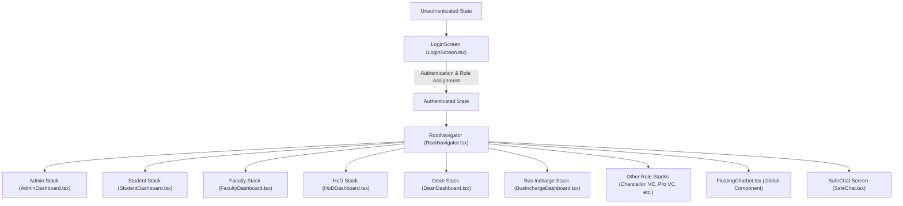
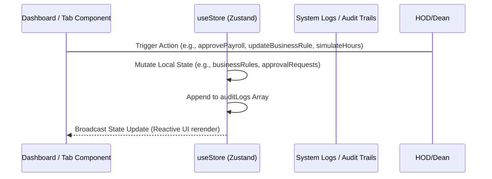
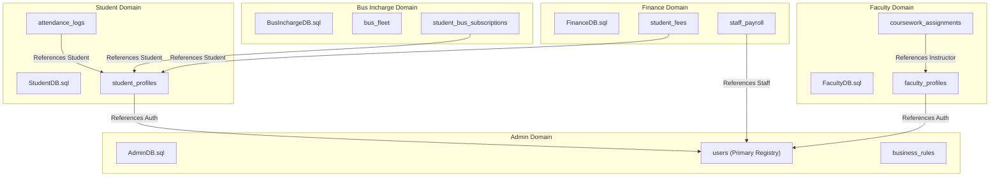

# Jeppiaar University ERP - System Pipeline Connectivity Map

This document tracks how screens, user roles, tab panels, and state structures connect.

---

## 🗺️ 1. Navigation Flow & Page Hierarchy

The app uses React Navigation Stack structure. Root navigation is handled dynamically inside [RootNavigator.tsx](file:///d:/University_ERP/src/navigation/RootNavigator.tsx) based on the current authenticated user's role:

---

## 🎛️ 2. Role Dashboard Tab Structure

Within each dashboard stack, navigation uses a state-driven sidebar/bottom-tab switching mechanism (`activeTab` state). Selecting a tab imports and loads the corresponding component:

### Admin Dashboard Tabs
*   **Overview**: Summary stats, live system metrics.
*   **Approvals Desk**: Review leave, budget, and marks locking requests.
*   **Analytics**: Student performance trends, health matrices.
*   **Surveys**: Create and review campus polls.
*   **Calendar**: Edit schedules, exams, and holidays.
*   **Registration**: Enroll new students or register new staff profiles.
*   **Financials**: View transaction logs, fee accounts.
*   **Assets**: Equipment database and maintenance logs.
*   **Payroll**: Salary ledger and disbursement approvals.
*   **Staff Master / Student Master**: Directories of active profiles.
*   **Timetable**: Schedule builder.
*   **Bus Route**: Manage transport, drivers, and GPS links.
*   **Rules Console**: Configure threshold settings (Attendance limit, placement parameters).
*   **Audit Logs**: Complete trail of database updates.

### Student Dashboard Tabs
*   **My Profile**: Digital ID card and emergency details.
*   **Academics**: List of registered courses and instructors.
*   **Timetable**: Weekly class slot schedule.
*   **Attendance**: Course-wise attendance percentages and eligibility flags.
*   **Marks**: CGPA tracker and internal grade transcripts.
*   **Assignments**: Download worksheets and submit PDF solutions.
*   **Leave**: Apply for OD and academic leaves.
*   **Fees**: View pending dues and execute mock payments.
*   **Hostel**: Room assignments and hostel dues ledger.
*   **Transport**: Selected bus route stops and timings map.
*   **Placement**: Upload CVs, get AI skill gap analyses, and view registered placement drives.
*   **Projects**: Guide allocation and final project milestones.
*   **Grievance**: Welfare Cell ticket submission form.

---

## ⚡ 3. State Management & Data Flow (Zustand)

Global actions and models reside in [useStore.ts](file:///d:/University_ERP/src/store/useStore.ts). When a value changes in the store, all screens refresh automatically:

---

## 🛢️ 4. Dynamic Relational Database Model

The database is built on a modular, domain-driven relational model. Each dashboard directory houses its own custom database blueprint (`DB.sql`) defining the tables it owns, but all directories are mapped and linked dynamically through relational integrity constraints:

### Key Relationships & Mappings:
1. **Core Identity Mapping**: `StudentDB.student_profiles` and `FacultyDB.faculty_profiles` map dynamically to `AdminDB.users` using foreign key references.
2. **Operations Mapping**: `FinanceDB.staff_payroll` references `AdminDB.users` to process monthly payroll.
3. **Academic Mapping**: `PlacementDB.drive_registrations` references `StudentDB.student_profiles` to screen CGPA and eligibility thresholds dynamically.
4. **Governance Mapping**: `VCDB.vc_approvals_ledger` and `ProVCDB.provc_budget_clearance` dynamically map to request streams from lower departments (such as HOD leaves or Dean budget allocations) to resolve workflows.
5. **Logistics Mapping**: `BusInchargeDB.student_bus_subscriptions` links to `StudentDB.student_profiles` to align active boarding stops with student enrollment files dynamically.
